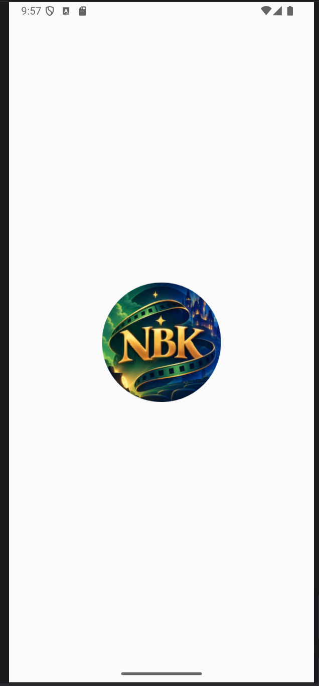
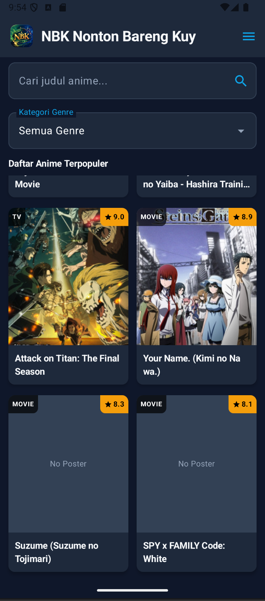
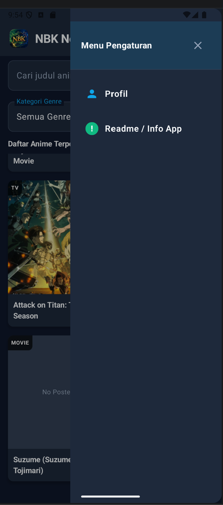
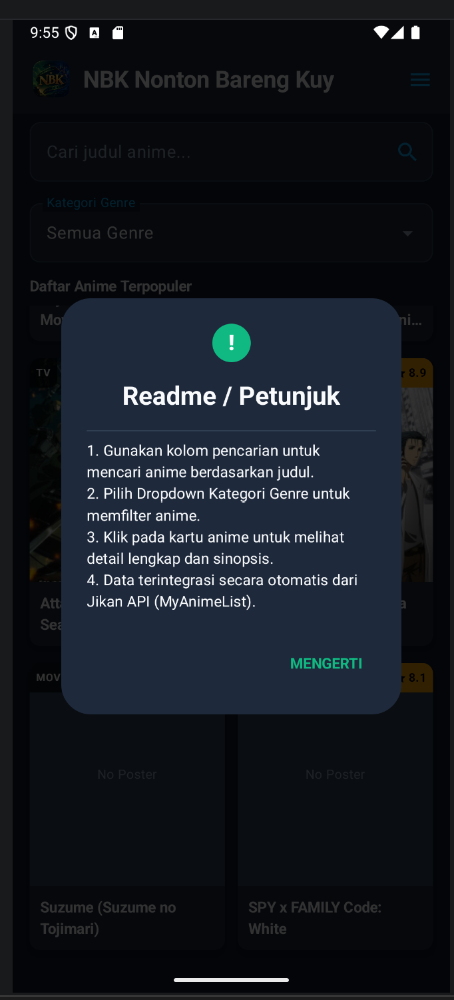
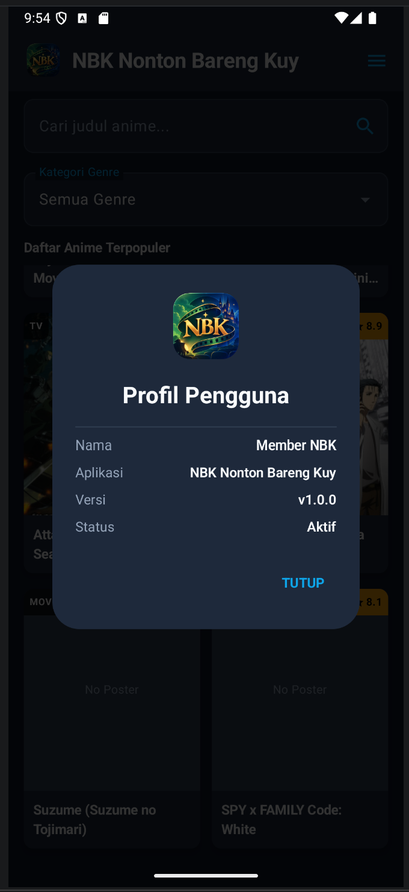
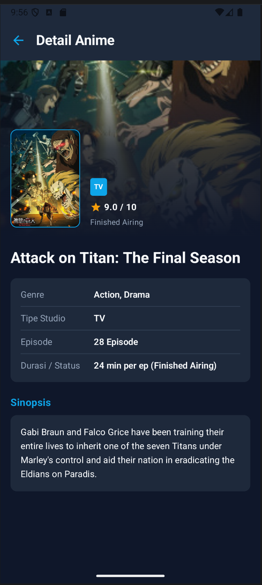

# NBK Nonton Bareng Kuy

**H1D024106 | Fikry Mumtaz Pratama | Responsi 1**

NBK Nonton Bareng Kuy merupakan aplikasi Android untuk mencari, melihat, dan membaca informasi anime menggunakan **Jikan API**. Aplikasi dikembangkan menggunakan **Kotlin**, **Jetpack Compose**, dan arsitektur **MVVM**.

## Identitas Proyek

| Informasi     | Detail                                                    |
| ------------- | --------------------------------------------------------- |
| Nama Aplikasi | NBK Nonton Bareng Kuy                                     |
| Repository    | H1D024106-FikryMumtazPratama-Responsi1-NBKnontonbarengkuy |
| NIM           | H1D024106                                                 |
| Nama          | Fikry Mumtaz Pratama                                      |
| Kegiatan      | Responsi 1                                                |
| Platform      | Android                                                   |

## Fitur

* Welcome Screen
* Home Screen
* Filter genre
* Detail informasi anime
* Menu aplikasi
* Profile pengguna
* Informasi aplikasi

## Tech Stack

| Teknologi          | Penggunaan          |
| ------------------ | ------------------- |
| Kotlin             | Bahasa pemrograman  |
| Jetpack Compose    | Antarmuka aplikasi  |
| Material 3         | Design system       |
| MVVM               | Arsitektur aplikasi |
| Navigation Compose | Navigasi            |
| Retrofit           | Komunikasi API      |
| Gson               | Parsing JSON        |
| Coil               | Memuat gambar       |
| Kotlin Coroutines  | Proses asynchronous |
| Jikan API          | Sumber data anime   |

## Screenshot

### Welcome Screen



### Home Screen



### Menu



### Info App



### Profile



### Detail Anime




## Arsitektur

Aplikasi menggunakan pola **Model-View-ViewModel (MVVM)**.

```text
Jetpack Compose UI
        |
        v
    ViewModel
        |
        v
    Repository
        |
        v
   Retrofit API
        |
        v
    Jikan API
```

Struktur utama project:

```text
app/src/main/java/com/example/animefinder/
├── data/
├── model/
├── network/
├── repository/
├── navigation/
├── theme/
├── ui/
├── viewmodel/
├── AnimeApplication.kt
└── MainActivity.kt
```

## Jikan API

Aplikasi menggunakan Jikan API sebagai sumber data anime.

**Base URL:**

```text
https://api.jikan.moe/v4/
```

Endpoint yang digunakan:

```text
GET /anime
GET /top/anime
GET /anime/{id}
GET /anime?q={query}
```

API digunakan untuk mengambil daftar anime, melakukan pencarian, filter, dan menampilkan informasi detail anime.

## Cara Menjalankan

Persyaratan:

* Android Studio
* JDK 17
* Android SDK
* Android Emulator atau perangkat Android

Clone repository:

```bash
git clone https://github.com/chiperfox4005/H1D024106-FikryMumtazPratama-Responsi1-NBKnontonbarengkuy.git
```

Kemudian buka project menggunakan Android Studio, lakukan **Gradle Sync**, hubungkan emulator atau perangkat Android, lalu jalankan aplikasi.

## Screenshot Repository

Seluruh screenshot aplikasi tersimpan pada folder:

```text
ScreenShoot/
├── Detail.png
├── Home.png
├── Profil.png
├── Tentang.png
├── Welcome.png
└── menu.png
```

Screenshot tersebut digunakan langsung oleh README untuk menampilkan tampilan aplikasi.

## Pengembang

**Fikry Mumtaz Pratama**
**H1D024106**
**Responsi 1**

Proyek ini dibuat untuk memenuhi kebutuhan akademik **Responsi 1**.
